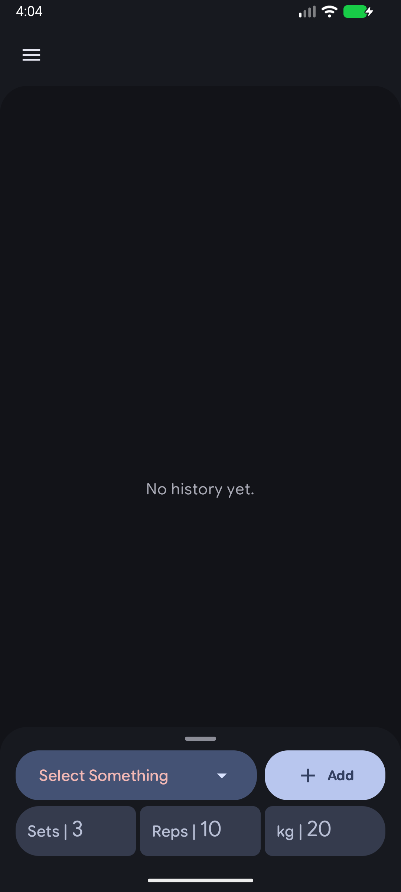
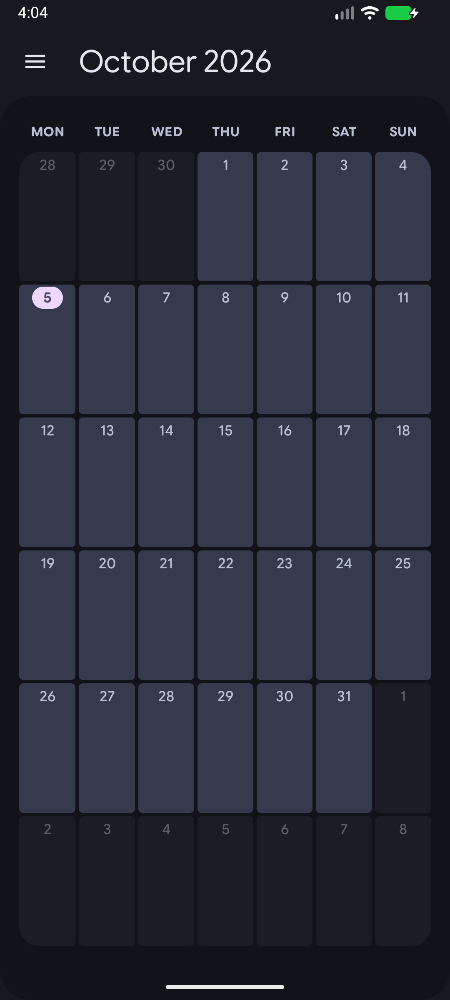
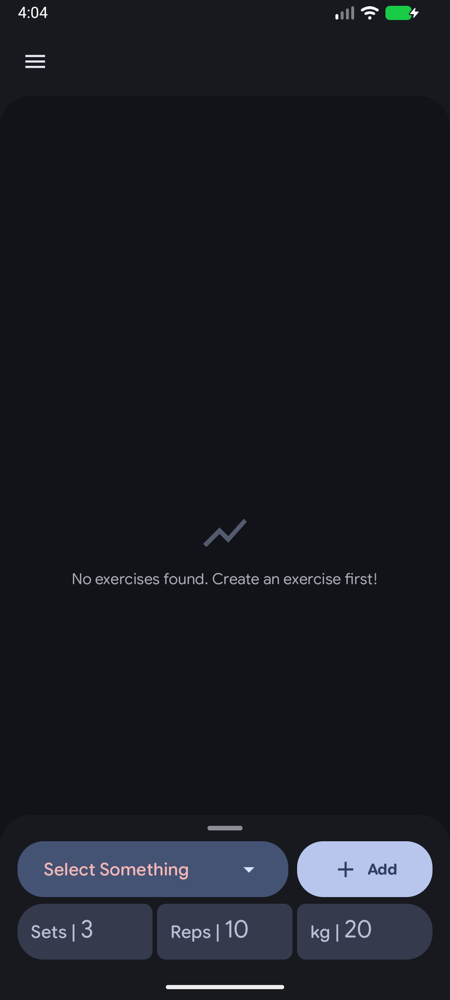
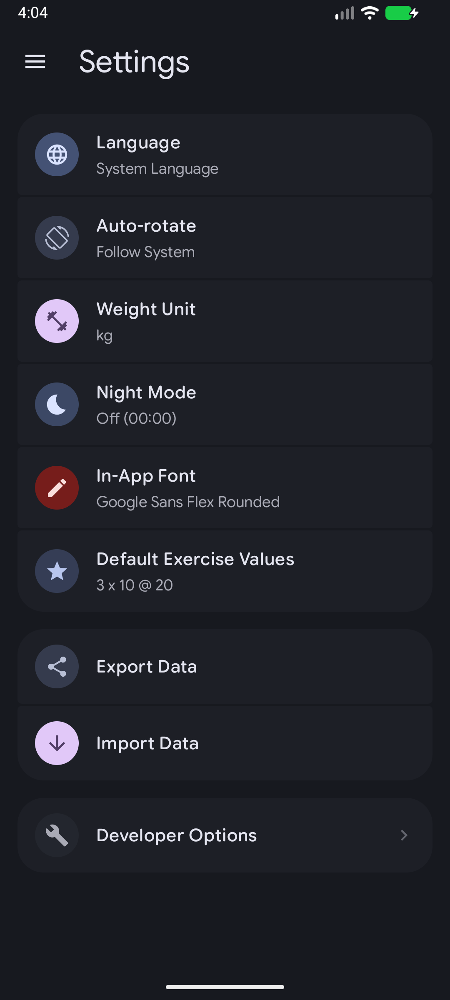

# Fitnez2

## Screenshots

Run `make screenshots` with one running Android 12+ emulator to rebuild and capture these screens at a standard 1080 × 2400 portrait resolution. Set `ANDROID_SERIAL` if more than one emulator is attached. The command uses a temporary emulator user so existing app data stays untouched; screenshots use Android dark mode and Material You dynamic colors.

<table>
  <tr>
    <td align="center"></td>
    <td align="center"></td>
  </tr>
  <tr>
    <td align="center"></td>
    <td align="center"></td>
  </tr>
</table>

A fitness tracking app for your weight exercises, specially made with Material 3 Expressive + own custom expressive components that go even further than the Material 3 Expressive library.

## Features

- Track exercises and workouts with ease.
- Built-in localization support (help me add more languages).
- Real-time UI updates for seamless workout logging.
- Track your progress using graphs.

## Build and Run

> All release APKs provided on the GitHub Releases page are built entirely in the open by GitHub Actions.

### Release Build (Manual)

If you still want to compile the production release yourself, run:

```bash
./gradlew assembleRelease
```

The compiled APK will be output to `app/build/outputs/apk/release/app-release.apk`.

# Help

- **Feedback Needed:** I am currently maintaining Fitnez2 based on my own workflow (primarily weightlifting) along with input from a few friends. I would love to hear from users who engage in other forms of exercise—such as running, sprinting, swimming, or team sports—to understand how the app could be improved to better support your routines. If you have any ideas or feature requests for specific workout types, please feel free to share them!

## License

This project is licensed under the GNU Affero General Public License v3.0 (AGPL-3.0). See the [LICENSE](LICENSE) file for details.
